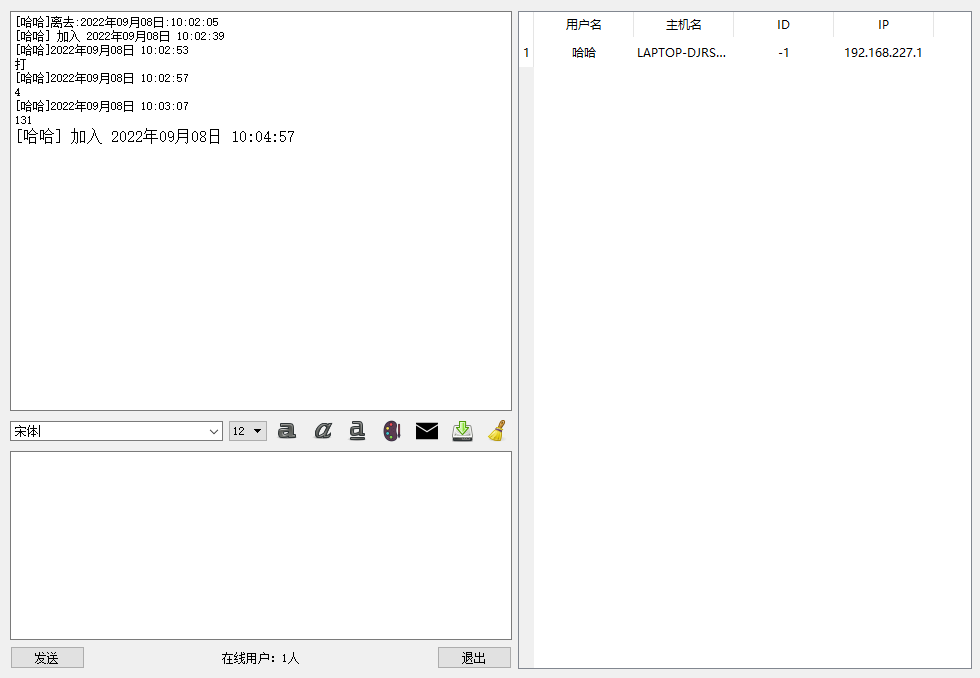
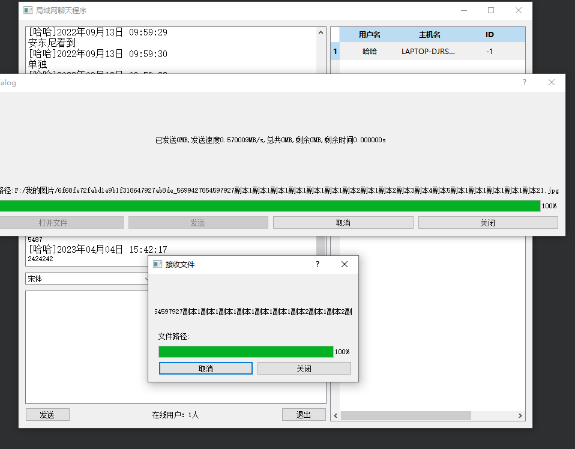

# 局域网聊天程序

#### 介绍
qt 写的局域网聊天程序

#### 软件架构
软件架构说明

#### 安装教程

1.  LANChat_APP_Release文件是用windeployqt.exe 动态连接而成的在里面找到exe文件程序就可以直接运行
2. LANChat文件是项目文件，有qt项目文件和源代码
3.

#### 使用说明

1.  登录界面

密码123456，用户名随意

2.  运行界面

3.文件传输

不过这个文件传输在release下会失效
我还没找到原因

3.  xxxx

#### 参与贡献

1.  Fork 本仓库
2.  新建 Feat_xxx 分支
3.  提交代码
4.  新建 Pull Request

#### 特技

1.  使用 Readme\_XXX.md 来支持不同的语言，例如 Readme\_en.md, Readme\_zh.md
2.  Gitee 官方博客 [blog.gitee.com](https://blog.gitee.com)
3.  你可以 [https://gitee.com/explore](https://gitee.com/explore) 这个地址来了解 Gitee 上的优秀开源项目
4.  [GVP](https://gitee.com/gvp) 全称是 Gitee 最有价值开源项目，是综合评定出的优秀开源项目
5.  Gitee 官方提供的使用手册 [https://gitee.com/help](https://gitee.com/help)
6.  Gitee 封面人物是一档用来展示 Gitee 会员风采的栏目 [https://gitee.com/gitee-stars/](https://gitee.com/gitee-stars/)
